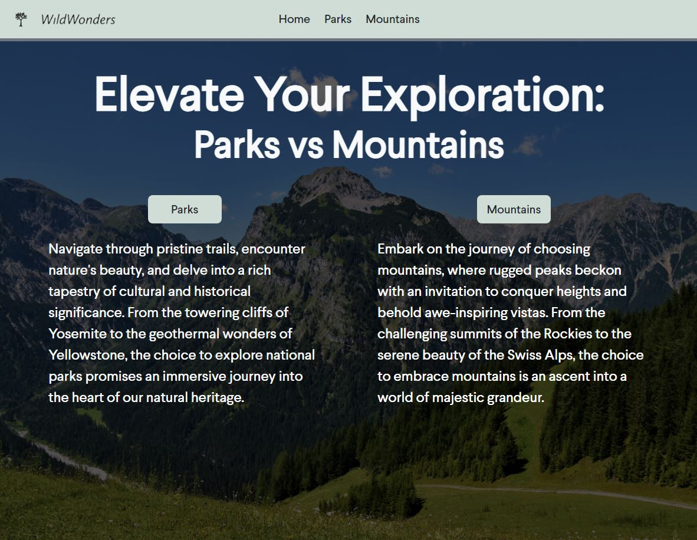
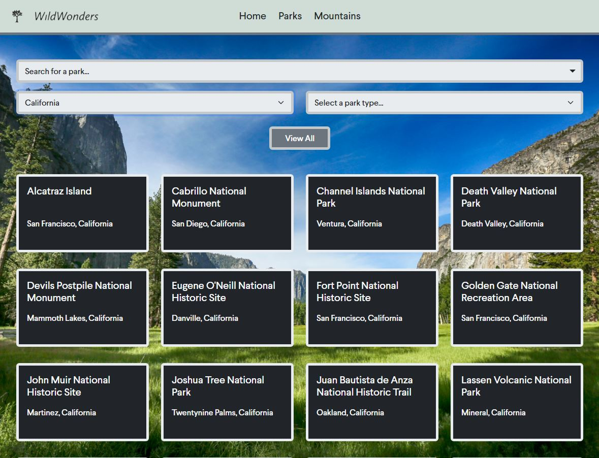
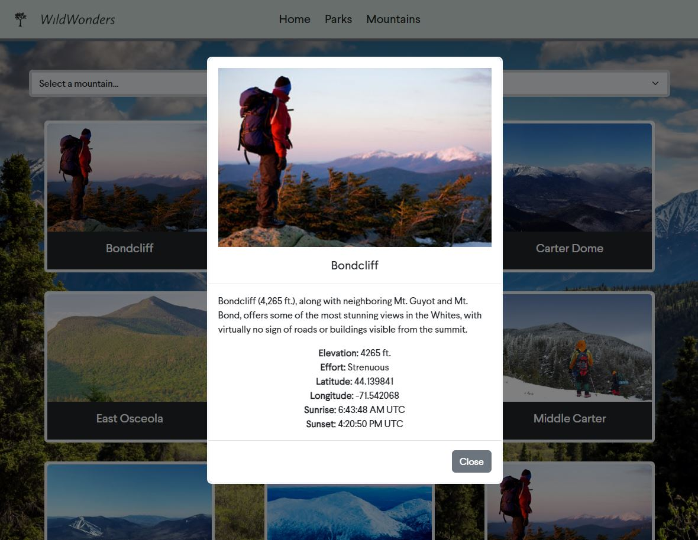

# WildWonders

[WildWonders](https://deli123.github.io/WildWonders/) is a website that lets you explore 359 national parks and 48 mountains in the USA.

# Features

- **Five pages**: Landing, parks, and mountains pages
- **Responsive Design**: Accessible on all devices, ensuring a smooth experience whether you're on a desktop, tablet, or mobile phone.
- **Search for parks**: Search through all 359 parks, possible options will be filtered on each input
- **Card & Modal combo**: Each park/mountain has a Card preview. Upon clicking on one, a Modal will pop up with more detailed information about the corresponding place.

# Technologies

- HTML
- CSS
- JavaScript
- Bootstrap 5
- [SunriseSunset API](https://sunrisesunset.io/api/)

# Previews

## Landing page



## Parks page



## Mountains page



# Code Snippet

Below is a code snippet of the function I used to populate all 359 parks when the "View All" button is clicked. Because there are 359 different parks, the page could potentionally freeze while they are being added to the HTML. In order to provide better feedback, I utilized a spinner component to display a loading icon while the parks are added asynchronously.

```js
const populateAllParks = () => {
  showElement(document.getElementById("spinner"));
  resetSelection("all"); // reset the Select fields back to the default selection
  parksContainer.innerHTML = "";

  setTimeout(() => {
    nationalParksArray.forEach((park, index) => {
      parksContainer.insertAdjacentHTML(
        "beforeend",
        createParkCard(park, index);
      );
      addModalTrigger(`park-${index}`);
    });
    hideElement(document.getElementById("spinner"));
  }, 100);
};
```
